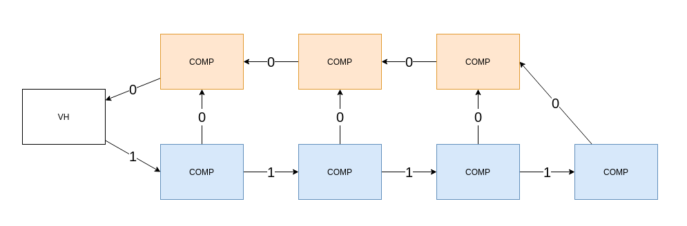
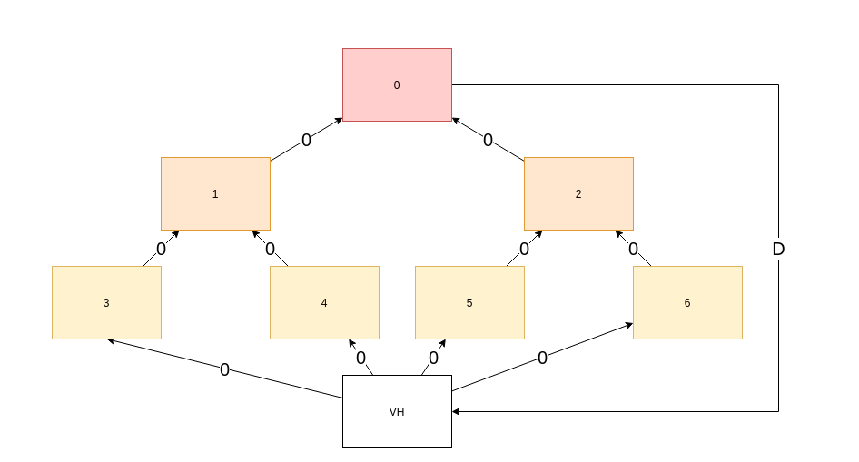
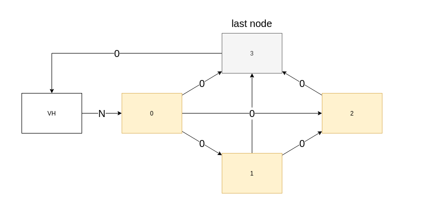

# Advanced Algorithm Circuit Retiming Project
<p align="center">
  
</p>
<p align="center">
  <a href="http://recsys.deib.polimi.it">
    
  </a>
</p>

# Index
* [Introduction](#Introduction)
* [Algorithms](#Algorithms)
* [Documentation](#Documentation)
* [Testing](#Testing)
* [Benchmark](#Benchmark)

# Introduction
[Retiming](https://www.wikiwand.com/en/Retiming) is the technique of moving the structural location of latches or registers in a digital circuit to improve its 
performance, area, and/or power characteristics in such a way that preserves its functional behavior at its outputs. 
Retiming was first described by Charles E. Leiserson and James B. Saxe in 1983.
The technique uses a directed graph where the vertices represent asynchronous combinational blocks and the directed 
edges represent a series of registers or latches (the number of registers or latches can be zero). 
Each vertex has a value corresponding to the delay through the combinational circuit it represents. 
After doing this, one can attempt to optimize the circuit by pushing registers from output to input and vice versa - 
much like bubble pushing. Two operations can be used - deleting a register from each input of a vertex while adding 
a register to all outputs, and conversely adding a register to each input of vertex and deleting a register from all 
outputs. In all cases, if the rules are followed, the circuit will have the same functional behavior 
as it did before retiming.

# Algorithms 
This repository contains a collection of scripts that implements two algorithm: **OPT_1** and **OPT_2**. Both the algorithms are described
in this [paper](https://cseweb.ucsd.edu/classes/sp17/cse140-a/exam/LeisersonRetiming.pdf).
Given a Graph with V vertices and E edges, the complexity of OPT_1 is **O(|V|^3 * lg|V|)** and the
complexity of OPT_2 is **O(|V| \* |E| \* lg|V|)**. So whenever *|E| < |V|^2*, the second algorithm is expected
to eventually have better performance.

# Documentation
The implementation of circuit retiming has been done in Python.

## Requirements
In order to run the code it is necessary to have:
* **Python**: version 3.8. 
* **Pip**: version 20.1.1.

If you do not have Python already installed, you can find it here: https://www.python.org/downloads/.

Install the python dependecies with the following bash command:
```shell script
pip install -r requirements.txt
```
This repository uses the following libraries:
* **numpy**, to handle arrays and matrixes.
* **networkx**, to handle graphs.
* **pygraphviz**, to view graphs.
* **matplotlib**, to plot graphs.
* **memory_profiler**, to profile the memory usage.
* **tqdm**, to monitor *for loops* and *multiprocess tasks*.
* **pandas**, to handle csv results.
* **plotly**, to plot the results in nice charts.

## gen_circuits.py:
The [gen_circuits.py](gen_circuits.py) script contains the functions to generate different types of circuits:
* N bit correlator.
    ```python
    import gen_circuits
    G = gen_circuits.gen_correlator(4)
    ```
    <p align="center">
      
    </p>
* Tree with B branches and D depth.
    ```python
    import gen_circuits
    G = gen_circuits.gen_tree(depth=2, n_branch=2)
    ```
    <p align="center">
      
    </p>
* Close to fully connected graph with N nodes.
    ```python
    import gen_circuits
    G = gen_circuits.gen_tree(nodes=4)
    ```
    <p align="center">
      
    </p>
For most of the circuits is possible to choose randomize the delay of each node.

## algorithm.py:
The [algorithm.py](algorithm.py) script contains the implementation of 5 algorithms described by Charles E. Leiserson and James B. Saxe.
* **CP**: Given a graph G, for each vertex V, it returns the maximum cost path without registers.
```python
import algorithm, gen_circuits
G = gen_circuits.gen_correlator(4)
X = algorithm.CP(G)
# RESULT
# X: {'vh': 24, 'vcomp_0': 3, 'vcomp_1': 3, 'vcomp_2': 3, 'vcomp_3': 3, 'vsum_0': 10, 'vsum_1': 17, 'vsum_2': 24}
```

* **WD**: Given a graph G, it uses Floyd-Warshall algorithm to build the W and D matrixes described in the paper.
```python
import algorithm, gen_circuits
G = gen_circuits.gen_correlator(4)
W, D = algorithm.WD(G)
# RESULT
# W: matrix([[0, 1, 2, 3, 4, 3, 2, 1],
#            [0, 0, 1, 2, 3, 2, 1, 0],
#            [0, 1, 0, 1, 2, 1, 0, 0],
#            [0, 1, 2, 0, 1, 0, 0, 0],
#            [0, 1, 2, 3, 0, 0, 0, 0],
#            [0, 1, 2, 3, 4, 0, 0, 0],
#            [0, 1, 2, 3, 4, 3, 0, 0],
#            [0, 1, 2, 3, 4, 3, 2, 0]])
```

* **OPT_1**: Given a graph G, a matrix W and a matrix D. It returns a retimed graph with minimum legal clock.
```python
import algorithm, gen_circuits
G = gen_circuits.gen_correlator(4)
W, D = algorithm.WD(G)
retimed_G = algorithm.OPT_1(G, W, D)
```

* **FEAS**: Given a graph G and a clock C, it returns a retimed graph with legal clock C if feasible. Otherwise None.
```python
import algorithm, gen_circuits
G = gen_circuits.gen_correlator(4)
retimed_G = algorithm.FEAS(G, 14)
```

* **OPT_2**: Given a graph G and a matrix D. It returns a retimed graph with minimum legal clock.
```python
import algorithm, gen_circuits
G = gen_circuits.gen_correlator(4)
W, D = algorithm.WD(G)
retimed_G = algorithm.OPT_1(G, D)
```

# Testing
The testing part of the project has been done using the circuits generated with _gen_circuits.py_. Furthermore, OPT_1 
and OPT_2 best clock results are compared and it is checked that they are equal.
The script responsible for the testing is [test.py](test.py).

* **Correlator N bit**:
Given a correlator circuit we know that a minimum clock retiming period of 14 is always possible.

* **Tree with B branches and D depth**:
Given a tree with B branches and D depth, we know that the minimum achievable clock is max(nodes_delay).

* **Graph N nodes**:
Given a graph with N nodes half connected, we know that the clock is max(nodes_delay).
This result is obtained by having a register in each edge of the graph.

# Benchmark
This section contains the benchmark of the two algorithms. It is composed by two subsections: the first one
is related to the time needed to compute the minimum clock and the second one reports the memory consumed.

Those benchmarks have been run on a Intel Xeon 2670 CPU.

## Time benchmark
The script [time_parallel_benchmark.py](time_parallel_benchmark.py) runs OPT_1 and OPT_2 on different circuits.
For each circuit, the algorithm is run 20 times in order to have a more stable result.
Before running the benchmark we expect that eventually circuits that have **E (Edges) < V^2 (Vertices)** performs better
with OPT_2 rather than with OPT_1.

#### Correlator data

#### Tree data

#### Graph data

#### OPT 1 vs OPT 2
In this chart the two algorithm are compared. In particular, the aim is to show that OPT 2 outperforms OPT 1 when
we the circuits have a small amount of edges.
The followings bubble charts (generated with the script [plot.py](plot.py)) highlight this behavior. The size of the 
bubble represents the time used with OPT 1 and the color represents the time taken by OPT 2. 
So the bigger is the bubble and more time is been required for OPT 1 to complete, and more *'yellowish'* is the bubble
and more time is been needed for OPT 2.

## Memory benchmark
This section reports the memory consumed by the algorithms. I do not think the report is very detailed since Python is a
garbage collected language, and the measurement has been done through 
[memory profiler](https://pypi.org/project/memory-profiler/) that under the hood uses 
[psutil](https://pypi.org/project/psutil/).
The script responsible of the memory benchmark is [mem_parallel_benchamrk.py](mem_parallel_benchmark.py) and the memory
usage is been monitored with an interval of *10ns*.
